# Lab #2,21110755, Pham Van Cao, Information Security_ Nhom 02FIE'

# Task 1: Public-key based authentication 
**Question 1**: 
Implement public-key based authentication step-by-step with openssl according the following scheme.


**Answer 1**:

Step 1: using openssl to generate public and private key in client 
- Generate a private key:
```sh
openssl genpkey -algorithm RSA -out client_private_key.pem -pkeyopt rsa_keygen_bits:2048
```

- Extract the public key: 

```sh
 openssl rsa -pubout -in client_private_key.pem -out client_public_key.pem
```

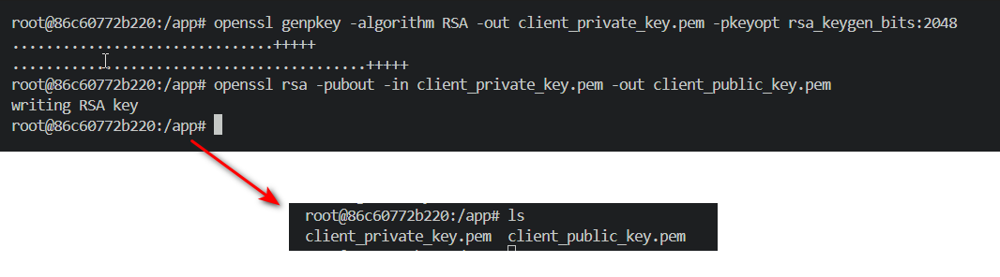

Step 2: Send the public key to the server using Netcat.
Afterward, use a hash function to verify that the keys on both the client and server are identical.

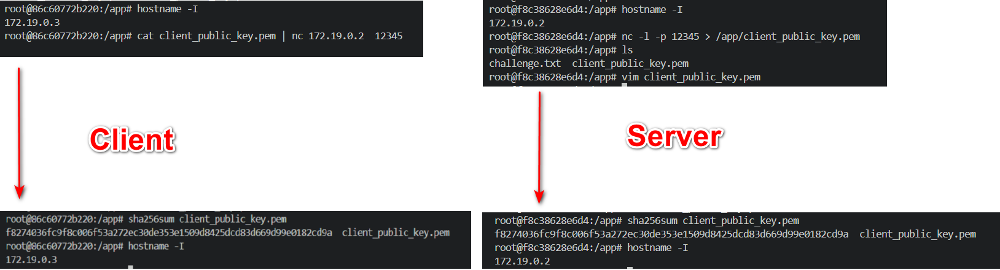

On the server, create a file named challenge.txt with the content: message. 
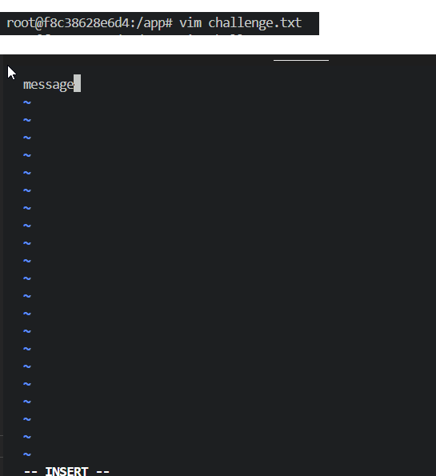

Encrypt the contents of the file using the client's public key: 

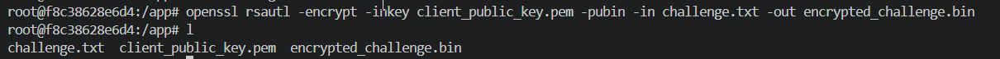

```sh
 openssl rsautl -encrypt -inkey client_public_key.pem -pubin -in challenge.txt -out encrypted_challenge.bin
```
-encrypt: Perform encryption.
-inkey client_public_key.pem -pubin: Use the client's public key.
-in challenge.txt: The file containing the challenge.
-out encrypted_challenge.bin: The encryption result will be saved in this file.

- Similarly to how the public key was sent earlier, transfer the encrypted content to the client using Netcat. : 

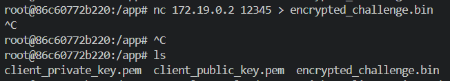

Decrypt the content using the private key to retrieve the exact file content from the server, which is message.

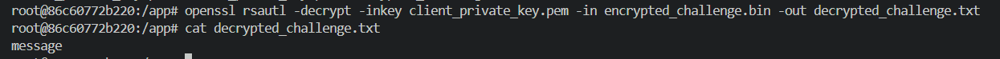

* Step 2: 
Sign the challenge using the private key:
```sh
openssl dgst -sha256 -sign client_private_key.pem -out signed_challenge.bin decrypted_challenge.txt
```
-sha256: Use the SHA-256 hashing algorithm to ensure security.
-sign client_private_key.pem: Sign the data using the Client's private key.
-out signed_challenge.bin: Save the resulting digital signature in this file.
decrypted_challenge.txt: The file containing the previously decrypted challenge message.

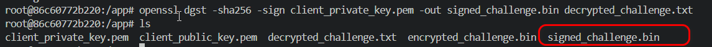

On the server, receive the file content via Netcat and verify the signature using the Client's public key:

Use the following command : 
```sh
openssl dgst -sha256 -verify client_public_key.pem -signature signed_challenge.bin challenge.txt
```
-sha256: Use the SHA-256 hashing algorithm (must match the algorithm used during signing).
-verify client_public_key.pem: Use the Client's public key to verify the signature.
-signature signed_challenge.bin: The file containing the Client's digital signature.
challenge.txt: The original challenge file sent by the server.

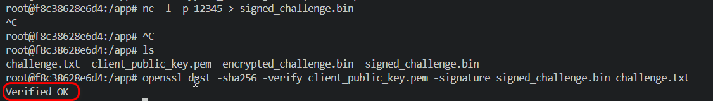

If the result returned is "OK," it indicates that the signature has been successfully verified. and we complete the lab.

Conclusion: 
Protecting information before transmission is a core factor in ensuring data security.
The use of encryption and digital signatures helps safeguard information, authenticate the identities of involved parties, and prevent risks of forgery or data theft.

Authentication mechanisms based on asymmetric encryption not only protect the information but also ensure that only the holder of the private key can participate in the communication. This approach enhances trust and security within the system.

# Task 2: Encrypting large message 
Create a text file at least 56 bytes.
**Question 1**:
Encrypt the file with aes-256 cipher in CFB and OFB modes. How do you evaluate both cipher as far as error propagation and adjacent plaintext blocks are concerned. 
**Answer 1**:
Generate a secret key (256-bit):(32 bytes = 256 bits)
=> 
```sh
openssl rand -hex 32 > aes256_key.bin
```
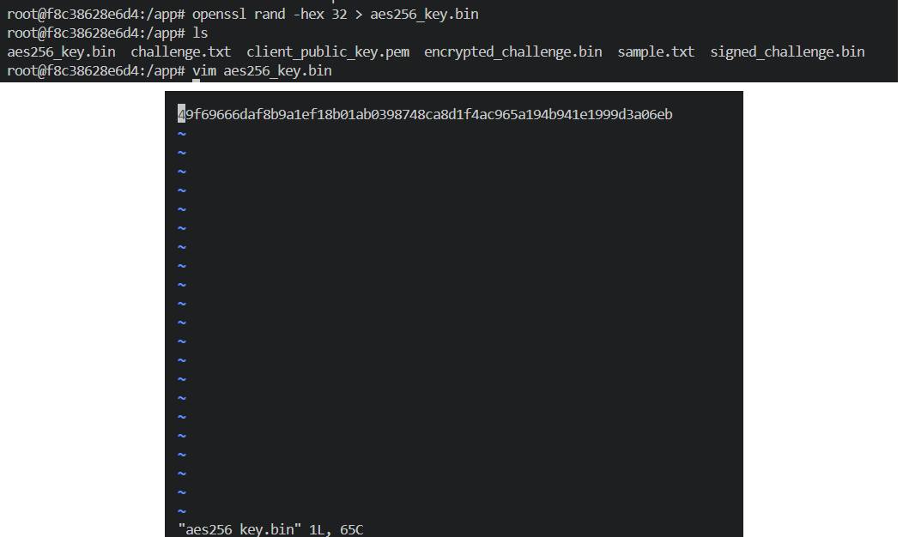

Create IV (Initialization Vector - 16 bytes): 
=> openssl rand -hex 16 > aes_iv.bin

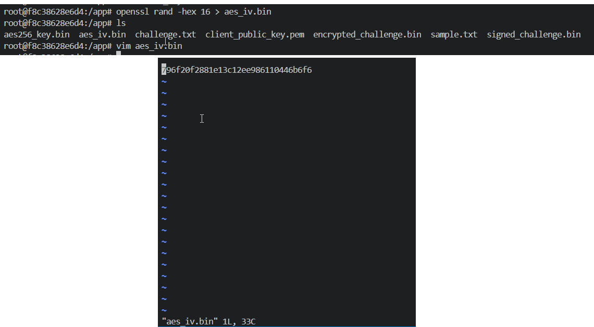

1. Encrypt a file (sample.txt) using the CFB (Cipher Feedback) mode
```sh
openssl enc -aes-256-cfb -in sample.txt -out sample_cfb.enc -K $(cat aes256_key.bin) -iv $(cat aes_iv.bin)
```
1.1 decrypt the file
```sh
openssl enc -d -aes-256-cfb -in sample_cfb.enc -out sample_cfb_dec.txt -K $(cat aes256_key.bin) -iv $(cat aes_iv.bin)
```
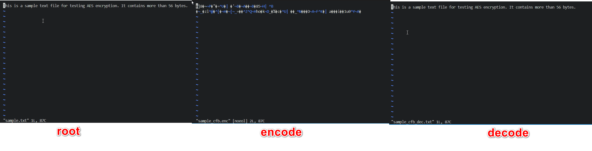

2. Encrypt the file sample.txt using the OFB (Output Feedback) mode: 
=> using the command : 
```sh
openssl enc -aes-256-ofb -in sample.txt -out sample_ofb.enc -K $(cat aes256_key.bin) -iv $(cat aes_iv.bin)
```
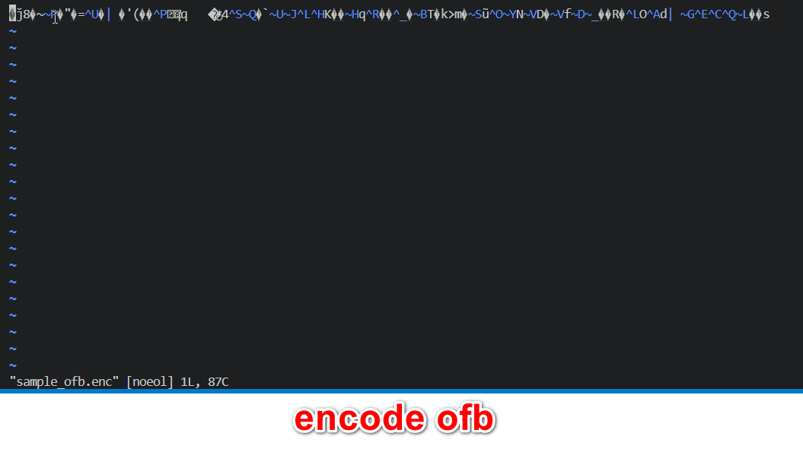

2.2 decrypt the file
```sh
openssl enc -d -aes-256-ofb -in sample_ofb.enc -out sample_ofb_dec.txt -K $(cat aes256_key.bin) -iv $(cat aes_iv.bin)
```
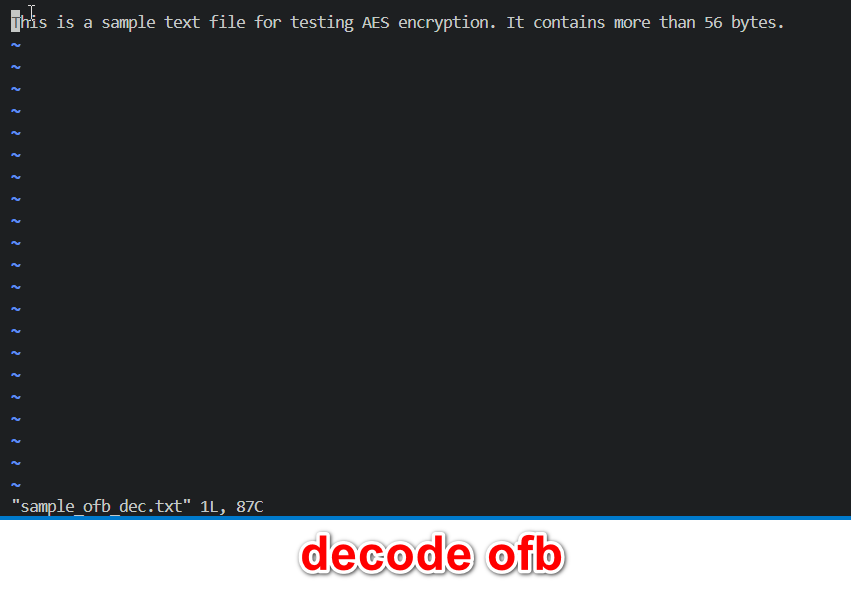

Looking at the two diagrams below, I can observe key differences in the behavior of CFB and OFB modes, particularly regarding **Error Propagation** and **Adjacent Plaintext Blocks**.


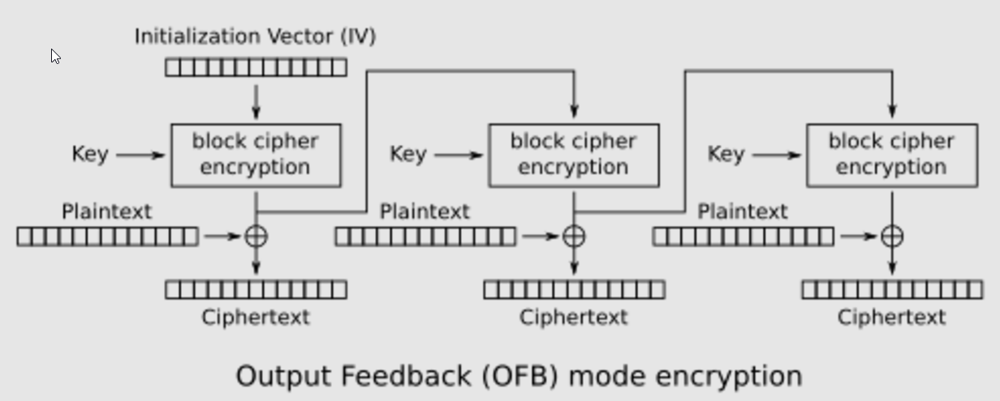
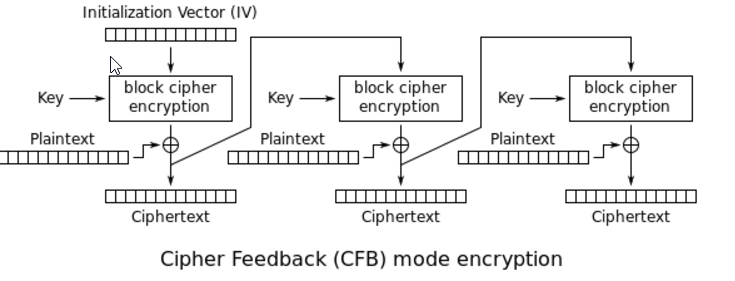

### Error Propagation 

- **CFB:** A single error in encryption/decryption at a specific position will only affect the corresponding plaintext block, but this error may propagate to the decryption of the next block (as CFB uses ciphertext as input for the next block).  
- **OFB:** There is no error propagation since OFB uses a keystream independent of the ciphertext. Errors only affect the specific position.

### Adjacent Plaintext Blocks

- **CFB:** Adjacent plaintext blocks are dependent on the ciphertext of the previous block, creating a strong relationship between them.  
- **OFB:** Adjacent plaintext blocks are independent of each other because the keystream is generated before encryption.

Conslusion: 

**Question 2**:
Modify the 8th byte of encrypted file in both modes (this emulates corrupted ciphertext).
Decrypt corrupted file, watch the result and give your comment on Chaining dependencies and Error propagation criteria.


**Answer 2**:
Step 1: 
Modify the 8th Byte in the CFB Encrypted File: 
```sh
xxd sample_cfb.enc > cfb.hex
xxd -r cfb.hex > sample_cfb_corrupted.enc
```
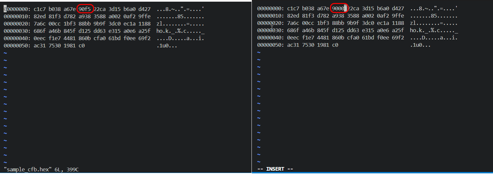

Modify the 8th Byte in the OFB Encrypted File
```sh
xxd sample_ofb.enc > ofb.hex
xxd -r ofb.hex > sample_ofb_corrupted.enc
```
Step 2: Decrypt the Corrupted File

Decrypt the Corrupted CFB Encrypted File: 
# Decrypt the corrupted CFB file
```sh
openssl enc -d -aes-256-cfb -in sample_cfb_corrupted.enc -out sample_cfb_dec.txt -K $(cat aes256_key.bin) -iv $(cat aes_iv.bin)
```
Decrypt the Corrupted OFB Encrypted File: 
# Decrypt the corrupted OFB file
```sh
openssl enc -d -aes-256-ofb -in sample_ofb_corrupted.enc -out sample_ofb_dec.txt -K $(cat aes256_key.bin) -iv $(cat aes_iv.bin)
```
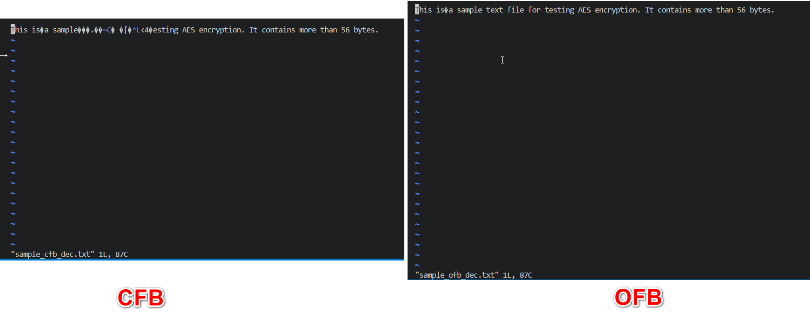

After decrypting the corrupted files compare the output and analyze the results.

CFB Mode:
Chaining Dependencies: In CFB, the error in the 8th byte of the ciphertext will affect the decrypted 8th byte and will propagate to the next block. The error will impact both the current and the next block of plaintext, causing an incorrect decryption of those two blocks.
Error Propagation: A single byte corruption leads to two affected blocks in decryption. The first block will be garbled because of the corrupted ciphertext, and the next block will also be incorrect due to the chaining effect.
OFB Mode:
Chaining Dependencies: In OFB, there are no chaining dependencies between blocks. Each keystream is generated independently of the ciphertext. Thus, the corruption of a single byte affects only the current block.
Error Propagation: The error will affect only the current block during decryption, and the following blocks will be decrypted correctly, as they are independent due to the pre-generated keystream. 

Conclussion:
* CFB Mode: Corruption in one byte leads to error propagation across two blocks (the current block and the next one), showing the chaining dependencies.
* OFB Mode: Corruption in one byte affects only the current block, with no effect on subsequent blocks, demonstrating no chaining dependencies.
